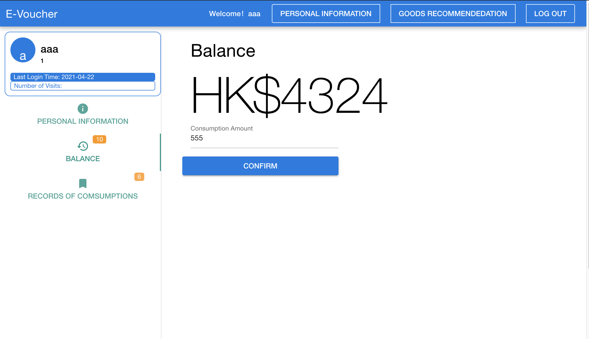

# py__system
web-based

## 1
VSCode:

terminal:run:

##### python manage.py runserver

## 2
VSCode:

terminal:run:

##### cd appfront

##### sudo rm -rf node_modules package-lock.json && npm install

##### npm run serve
<<<<<<< HEAD

##3

=======
>>>>>>> 4006206c60e05b6393d8972cad8e30a77e60ac73
